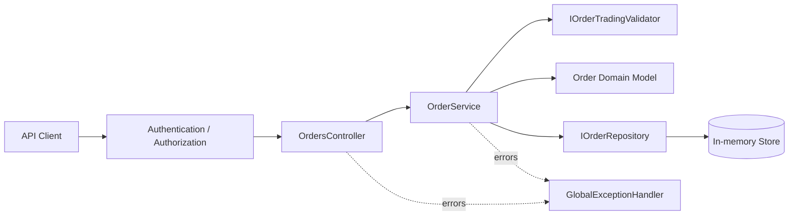

# Order Creation API

[](https://github.com/alexKuzovkov/order-creation-api/actions/workflows/ci.yml)


**Production-oriented .NET 9 API sample focused on safe order creation, idempotency, authorization, domain invariants, consistent HTTP semantics, and automated testing.**

This repository demonstrates how a seemingly simple `POST /orders` endpoint becomes an engineering problem once retries, concurrent requests, authentication, authorization, validation, user isolation, error contracts, and future persistence are considered.

> The project intentionally keeps persistence in memory so the important API and application-layer decisions remain easy to inspect. The README explicitly separates guarantees implemented by the sample from guarantees that require a production database.

## Highlights

- **.NET 9 / ASP.NET Core**
- Thin controllers and explicit application boundaries
- Policy-based authorization
- Demo header authentication that can be replaced by JWT/OIDC without changing business code
- **Idempotent order creation** using `ClientOrderId`
- Safe handling of **concurrent duplicate requests**
- Conflict detection when the same idempotency key is reused with a different payload
- Domain invariants in `Order.Create`
- Explicit `OrderState` enum
- Configurable max-notional trading rule
- `201 Created` with a real GET resource route
- User-isolated order lookup
- Centralized **Problem Details** exception handling
- `CancellationToken` propagation
- `TimeProvider` for testable UTC time
- Unit + API integration tests
- Docker Compose
- GitHub Actions with a full PowerShell E2E suite

## Architecture



### Responsibility split

| Component | Responsibility |
|---|---|
| `OrdersController` | HTTP transport, status codes, route semantics |
| `ICurrentUser` | Resolves the authenticated user from trusted claims |
| `OrderService` | Normalization, idempotency workflow, orchestration |
| `Order` | Domain invariants and immutable order state at creation |
| `IOrderTradingValidator` | Business/trading rules |
| `IOrderRepository` | Storage abstraction and atomic get-or-add semantics |
| `GlobalExceptionHandler` | Stable Problem Details error contract |

## Order lifecycle representation

Orders use an explicit enum instead of string or boolean state:

```csharp
public enum OrderState
{
    Active = 1,
    Completed = 2,
    Inactive = 3,
    Faulted = 4
}
```

The creation API creates an order in `Active` state. Lifecycle transitions are intentionally outside the scope of this repository; they are represented in the separate real-time order project.

JSON serializes the state as a string:

```json
{
  "state": "active"
}
```

## Idempotent creation

Clients send a stable `ClientOrderId`.

The effective idempotency key is:

```text
(UserId, ClientOrderId)
```

The behavior is deliberate:

| Request | Result |
|---|---|
| First request | `201 Created` |
| Same key + same payload | `200 OK`, existing order |
| Same key + different payload | `409 Conflict` |
| Concurrent retries with same payload | exactly one order is stored |

The in-memory repository uses `ConcurrentDictionary.GetOrAdd` as the atomic gate, so concurrent requests do not create several process-local orders.

### Production persistence

A database-backed implementation should move the final guarantee to a unique constraint:

```text
UNIQUE (UserId, ClientOrderId)
```

A pre-insert `SELECT` is not enough because two requests can pass the check concurrently. The database constraint must remain the source of truth.

## HTTP semantics

### Create order

```http
POST /api/v1/orders
X-User-Id: <guid>
X-Permissions: orders:create
Content-Type: application/json
```

```json
{
  "clientOrderId": "client-order-001",
  "symbol": "btcusd",
  "price": 100,
  "volume": 2
}
```

First successful request:

```text
201 Created
Location: /api/v1/orders/{orderId}
```

An idempotent retry returns:

```text
200 OK
```

### Read order

```http
GET /api/v1/orders/{orderId}
X-User-Id: <guid>
```

The API returns `404` when the order does not exist **or belongs to another user**, avoiding cross-user resource disclosure.

## Authentication and authorization

The sample includes a lightweight header-based authentication handler for local testing:

```text
X-User-Id: <guid>
X-Permissions: orders:create
```

This is intentionally a demo adapter. In production it should be replaced by JWT Bearer / OpenID Connect while the controller and application service remain unchanged.

Order creation requires the policy:

```text
CanCreateOrders
```

which requires the claim:

```text
permission = orders:create
```

## Validation layers

The project separates three kinds of validation.

### Transport validation

DataAnnotations validate the HTTP request shape. `[ApiController]` automatically returns `400 ValidationProblemDetails`.

### Domain invariants

`Order.Create` independently verifies invariants such as:

- non-empty user id
- required `ClientOrderId`
- required symbol
- positive price
- positive volume

This prevents invalid domain objects even when the domain is called outside HTTP.

### Trading rules

`OrderTradingValidator` enforces configurable business rules. The sample includes `MaxNotional`:

```json
{
  "OrderTrading": {
    "MaxNotional": 10000000
  }
}
```

A violation returns `422 Unprocessable Entity`.

## Error contract

Application and domain failures are mapped centrally through `IExceptionHandler` and Problem Details. Authentication and authorization status codes are produced by the ASP.NET Core security middleware.

| Situation | HTTP status |
|---|---:|
| Invalid DTO | 400 |
| Missing authentication | 401 |
| Missing create permission | 403 |
| Same idempotency key, different payload | 409 |
| Domain/trading rule violation | 422 |
| Missing or another user's resource | 404 |
| Unexpected failure | 500 |

Unexpected exception details remain in logs; clients receive a stable safe response with `traceId`.

## Transactional Outbox — production evolution

The current in-memory implementation does not publish integration events, so it does not pretend to provide a transactional outbox.

A production persistence layer could evolve the write path to:

```text
Database transaction
      │
      ├── Order
      └── OutboxMessage
              │
              ▼
           COMMIT
              │
              ▼
       Outbox Publisher
              │
              ▼
        Message Broker
```

The order row and outbox row should be committed atomically. A bounded background publisher can then deliver messages with retry/backoff and idempotent event identifiers.

## Repository structure

```text
order-creation-api/
├── .github/
│   └── workflows/
│       └── ci.yml
├── src/
│   └── OrderCreation.Api/
│       ├── Application/
│       ├── Authentication/
│       ├── Contracts/
│       ├── Controllers/
│       ├── Domain/
│       ├── Infrastructure/
│       ├── Program.cs
│       └── appsettings.json
├── tests/
│   └── OrderCreation.Api.Tests/
├── Dockerfile
├── docker-compose.yml
├── test_all.ps1
├── test_all.sh
└── README.md
```

## Testing

### Unit and API integration tests

```bash
dotnet test tests/OrderCreation.Api.Tests/OrderCreation.Api.Tests.csproj
```

Coverage includes:

- domain invariants
- default order state
- concurrent repository idempotency
- user isolation
- same-payload retries
- conflicting idempotency payloads
- concurrent service retries
- max-notional validation
- authentication and authorization
- `201` / `200` / `401` / `403` / `409` / `404` API behavior

### Full PowerShell E2E

```powershell
.\test_all.ps1 -StartServices
```

The same command runs in GitHub Actions against the Dockerized API.

The E2E suite verifies:

1. health
2. authentication and authorization
3. request validation
4. create + GET route semantics
5. `OrderState.Active`
6. idempotent retries
7. conflicting idempotency payloads
8. user isolation
9. trading-rule validation
10. missing resources

## Run locally

### Docker

```bash
docker compose up --build
```

API:

```text
http://localhost:5000
```

Health:

```text
http://localhost:5000/health
```

### .NET CLI

```bash
dotnet run --project src/OrderCreation.Api
```

## Engineering trade-offs

This repository focuses on API correctness and request-processing guarantees rather than platform completeness.

Deliberately outside the sample:

- durable database persistence
- external identity provider
- message broker
- transactional outbox implementation
- secret management
- distributed tracing backend
- production rate limiting

The in-memory repository provides process-local behavior only and must not be treated as a substitute for a database in a multi-instance production deployment.
